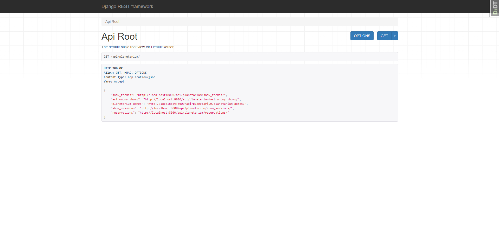
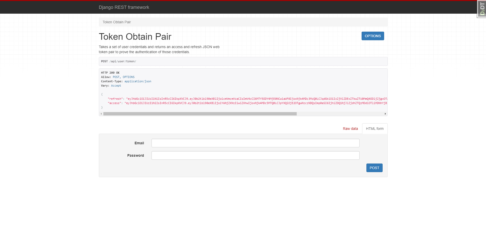
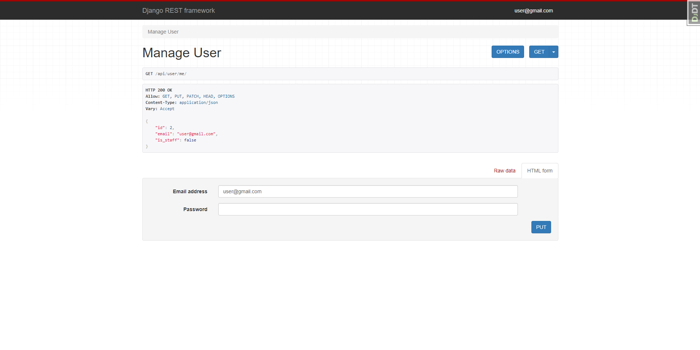
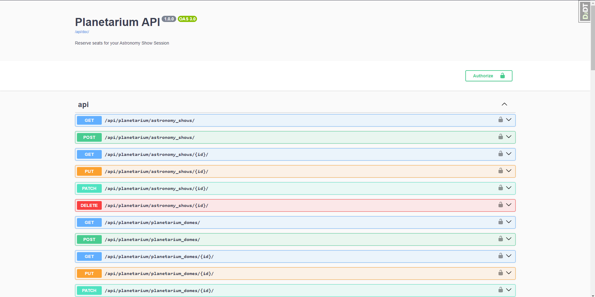

# Planetarium Django API

---

The Planetarium Django API project is an API server developed using the Django framework. This API allows you to manage Astronomy Shows, Show Sessions, Planetarium Domes and Reserve seats for one of them. 

## Installation

---
To install and run the project on your local computer, follow these steps:

```shell
  git clone https://github.com/KristianYe/Planetarium-API-Service.git
  cd planetarium-django-api
  python -m venv venv
  source venv/bin/activate  # On Linux/Mac
  venv\Scripts\activate  # On Windows
  pip install -r requirements.txt
  python manage.py migrate
  python manage.py loaddata data.json # to load test data
  python manage.py runserver
```
After completing these steps, the API will be available at http://localhost:8000/.

## Usage

---
#### The API provides the following endpoints:

- `api/planetarium/`: List of all endpoints in planetarium
- `api/user/register/`: Register new user 
- `api/user/me/`: Manage your account
- `api/user/me/token/`: Get Access Token for using planetarium api
- `api/user/me/token/refresh/`: Refresh Access Token via Refresh Token
- `api/user/token/verify/`: Validate your token 
- `api/doc/swagger/`: Full documentation with each endpoint on swagger ui
- `api/doc/redoc/`: Full documentation with each endpoint on redoc


## Data for authentication

---
You can create your own profile via `/api/user/register/` or use next credentials:
```
Login: user@gmail.com
Password: test_user
```

## Features

---

### Astronomy Shows

- Create, retrieve, update, and delete Astronomy Shows.
- List all Astronomy Shows.
- Filter by title and Show Themes ids.

### Show Themes

- Create, retrieve, update, and delete Show Themes.
- List all Show Themes.
- Filter by Show Theme name.

### Show Sessions

- Create, retrieve, update, and delete Show Sessions.
- List all Show Sessions.
- Filter by date and Show title.
- Check the number of available tickets when viewing each Session.

### Planetarium Domes

- Create, retrieve, update, and delete Planetarium Domes.
- List all Planetarium Domes.
- Filter by Planetarium Dome name.

### Ticket Reservations

- Reserve tickets for any Show Session.

## Demo

---
### Planetarium Api Root

### Token Retrieve

### User Profile

### Documentation

